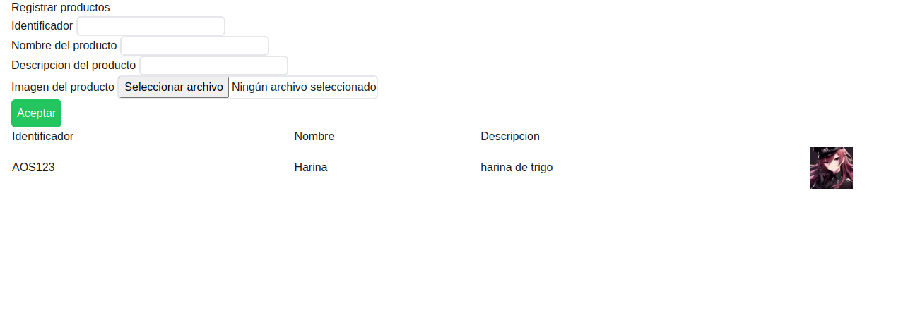

# Prueba tecnica para Software Factory

Prueba tecnica que consiste en un CRUD capaz de guardar productos, con sus caracteristicas como identificador, imagen, nombre y descripcion

Para poder ejecutar el proyecto se debe configurar las variables de entorno e iniciar el servidor de desarrollo

Tanti el cliente como la API estan hechos en NEXT

